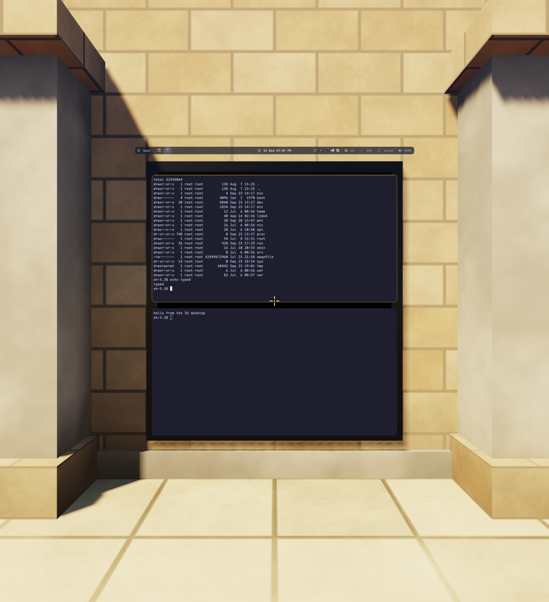
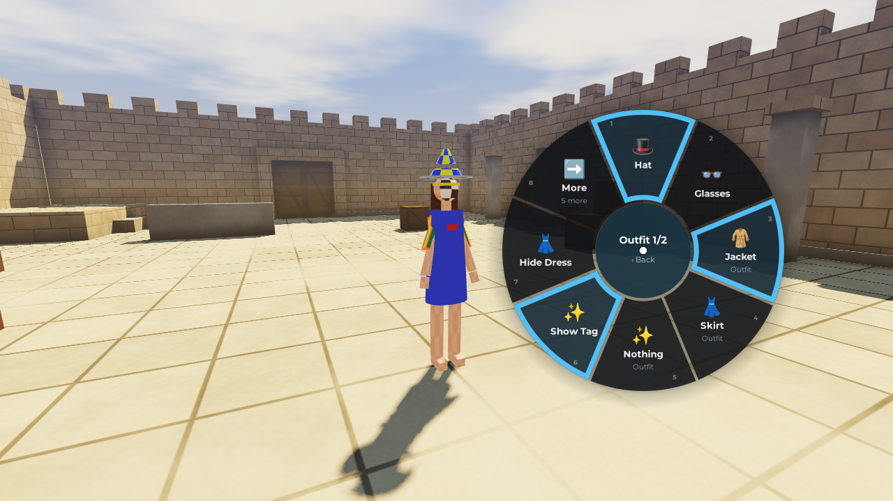
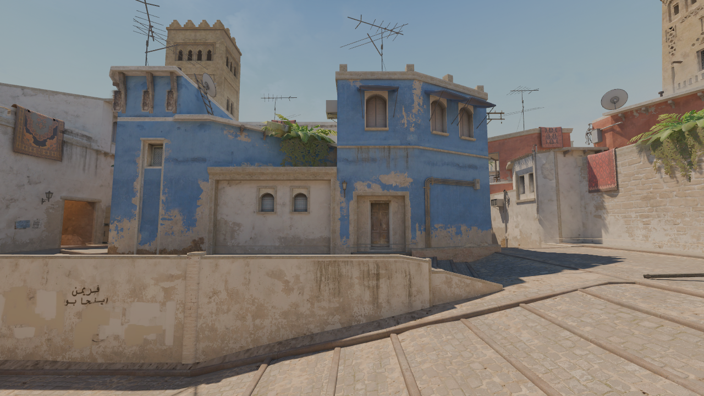

# hypr3d

A [Hyprland](https://hyprland.org) plugin that turns the desktop into a place you can walk around in.
While 3D mode is on, your windows hang on a wall in a small courtyard, or in any glTF map, and you
walk up to them in first person. The crosshair clicks, scrolls and types into whatever it points at.
You can take a window off the wall and put it anywhere.

With an avatar loaded you can switch to third person. The avatar works much like one in VRChat: it
has faces, hand gestures, emotes and dances, a radial Action Menu, outfit toggles and sliders, hair
and clothes that swing, toon outlines, and lip sync from your microphone if you turn it on. It can be
a VRM, a plain GLB, or a VRChat avatar converted with `tools/unity2hypr3d.py`.







## Building

hypr3d is built against the Hyprland it runs in: a plugin has to be compiled with the headers and the
compiler of that exact Hyprland build. It was written for Hyprland 0.55.2 on NixOS.

```sh
./build.sh          # builds hypr3d.so
./build.sh clean
```

`build.sh` finds the running Hyprland binary (`pgrep`, then `/proc/<pid>/exe`) and asks Nix for the
derivation that built it (`nix-store --query --deriver`). It builds that derivation's `dev` output,
which holds the headers, and then runs `make` inside the derivation's own build shell
(`nix develop "<drv>^*"`). That gives the same compiler and flags Hyprland was built with. If
Hyprland isn't running, name its binary:
`HYPR_BIN=/nix/store/…-hyprland-…/bin/Hyprland ./build.sh`. Any arguments go on to `make`.

Hyprland's build shell has no audio library, so for lip sync's microphone `build.sh` does the same
for the PipeWire that runs: it finds its binary, builds its derivation's `dev` output and adds that
to `pkg-config`'s path. The plugin then links `libpipewire-0.3` from that PipeWire. Without it (no
PipeWire running, or its derivation gone), hypr3d builds without a microphone, and lip sync says so
when you turn it on. The `dev` output may not be in the binary cache; then Nix builds PipeWire once.

On other distributions, `make` should work anywhere `pkg-config` finds the headers of the Hyprland
you run (`hyprland`, `pixman-1`, `libdrm`, `glesv2`, `egl`, `cairo` and `pangocairo`, and
`libpipewire-0.3` for the microphone if it is there). This is untested.

## Loading

```sh
hyprctl plugin load "$PWD/hypr3d.so"      # an absolute path
hyprctl plugin unload "$PWD/hypr3d.so"
```

To keep it, load it from your config. With a Lua config (Hyprland's `hl.*` API, which is also what
home-manager can write), use this:

```lua
hl.plugin.load("/home/you/Documents/3D/hypr3d.so")
hl.config({ plugin = { hypr3d = {
    avatar = "~/avatars/me.glb",
    avatar_physics = true,
} } })
hl.bind("SUPER + grave", function() hl.plugin.hypr3d.toggle() end)
```

`hl.config` flattens nested tables, so `plugin = { hypr3d = { map = … } }` sets
`plugin:hypr3d:map`. The plugin's values only exist once it is loaded, and Hyprland reloads the
config after loading a plugin. With a classic `hyprland.conf`, use
`plugin { hypr3d { avatar = ~/avatars/me.glb } }` and `bind = SUPER, grave, hypr3d:toggle`.

A plugin runs inside the compositor, so a crash in it takes your session down with it.

## Config

| Value | Default | What it does |
|---|---|---|
| `plugin:hypr3d:layer_spacing` | `0.02` | metres between stacked layers (bars, notifications) on the desktop wall, 0–0.5 |
| `plugin:hypr3d:wallpaper` | `false` | keep the wallpaper on the desktop wall in 3D |
| `plugin:hypr3d:map` | `""` | a glTF/GLB map to walk around in, instead of the courtyard |
| `plugin:hypr3d:map_scale` | `0` | metres per map unit; 0 guesses it from the map |
| `plugin:hypr3d:avatar` | `""` | a glTF, GLB or VRM avatar, seen in third person |
| `plugin:hypr3d:avatar_height` | `0` | scale the avatar to this height in metres; 0 keeps its own |
| `plugin:hypr3d:avatar_physics` | `true` | hair, skirts and the like swing (spring bones) |
| `plugin:hypr3d:avatar_emotes` | `""` | more emotes: VRM animations (`.vrma`) or glTF clips; files or folders, separated by commas |
| `plugin:hypr3d:lipsync` | `false` | lip sync: the microphone moves the avatar's mouth while you are in 3D (below) |

Paths may start with `~/`. Maps and avatars load in the background, and a failure shows up as a
notification. A config reload applies changed values at once; a value changed at run time without one
(`hyprctl keyword plugin:hypr3d:…`, or `hl.config()` through `hyprctl eval`) takes effect within a
second.

## Controls

Enter and leave 3D with the `hypr3d:toggle` dispatcher, `hyprctl hypr3d toggle` or
`hl.plugin.hypr3d.toggle()`. Keys held with Super, or with Ctrl+Alt, still go to Hyprland, so your
compositor shortcuts keep working in 3D.

| Input | In 3D |
|---|---|
| mouse, arrow keys | look around |
| W A S D | walk; Left Shift runs |
| Space | jump (flying: up) |
| Left Ctrl or C | crouch (flying: down) |
| F | fly on/off |
| R | back to the start |
| left/right/middle click | click whatever the crosshair points at |
| wheel | scroll it; in third person, pointing at nothing, zoom the camera |
| E or Enter | type into the window under the crosshair; Super+Esc goes back to walking |
| G | pick up the window under the crosshair; G or a left click puts it down where it is, a right click or Esc puts it back where it was; the wheel moves it nearer or further, Ctrl+wheel resizes it |
| X | send a window you've placed back to the wall |
| V | first / third person (needs an avatar) |
| Tab | the Action Menu |
| F1–F8 | hand gestures (Neutral, Fist, Open, Point, Victory, Rock'n'roll, Handgun, Thumbs up), as in VRChat's desktop mode: with Left Shift held only the left hand, with Right Shift only the right, otherwise both |
| Esc | leave 3D |

The Action Menu has pages for emotes, expressions, gestures, the outfit and options (view, physics,
fly, lip sync, respawn, reset face, stop emote). With it open, the mouse moves its cursor, a left click
picks, a right click goes back and a middle click closes it. The wheel goes round it, 1–8 pick an
item, Enter picks, Backspace goes back and Esc closes it. WASD still walks.

A slider on the outfit page (🎚️, VRChat's radial puppet) opens a dial. The cursor sets it by going
round from the top, clockwise from 0% to 100%. It stops at the ends rather than jump across the top.
The wheel moves it in 5% steps, and 1–8 set 0%, 14%, … 100%. A click, Backspace or a right click
closes the dial.

A two-axis puppet (🕹️, VRChat's and VRCFury's two- and four-axis puppets) opens a stick instead:
where the cursor is in the disc sets x and y, −1 to 1 each, right and up positive, and 1–8 push it
all the way in the eight directions, from up clockwise.

**Lip sync** is off until you turn it on: with `lipsync = true` in the config,
`hyprctl hypr3d avatar lipsync on`, or the Action Menu's options. Then, while you are in 3D with an
avatar, hypr3d listens to your default microphone through PipeWire (as the "hypr3d lip sync"
stream), and a red "lip sync: listening" badge sits in the top right corner, below Hyprland's
notifications while any show. How loud you are opens the mouth, and the vowel you make (its first
two formants, from linear prediction; a window counts as voiced when it's periodic, or when its
formants stand out) picks the shape: the avatar's aa, ih, ou, ee and oh visemes. Consonants that
show use the avatar's own consonant visemes where it has them (VRChat's `vrc.v_pp`, `vrc.v_ff`,
`vrc.v_ss` and `vrc.v_ch`, or the settings file's `visemes`): an s, z or ts (and Japanese し and ち)
shows ss, a rounder sh ch, a flat, faint f ff, and a low murmur well under the voice (an m, or the
voice trailing off) pp. Otherwise a consonant keeps the last vowel's shape, less open, for a moment.
Hiss or noise that goes on shuts the mouth. It keeps a quarter of a second of sound at most, to look
at, and nothing is written anywhere or sent. Leaving 3D, or turning it off, closes the microphone.

## hyprctl

`hyprctl hypr3d` with no arguments prints the state as JSON. Commands:

| Command | |
|---|---|
| `status`, `toggle`, `on`, `off [now]` | the state as JSON; enter and leave 3D |
| `type [on\|off]` | type into the window under the crosshair, or go back to walking |
| `look dx dy`, `turn yaw pitch`, `tp x y z` | turn by mouse counts, turn to angles in degrees, teleport |
| `walk secs [forward\|back\|left\|right]`, `jump`, `fly` | move from a script |
| `click [left\|right\|middle]` | click where the crosshair is |
| `sens [value]` | mouse sensitivity |
| `grab`, `place`, `hold dist [scale]`, `reset-windows` | carry windows, and put them all back |
| `windows` | the windows off the wall: where, how far from your eye and how big (1 = as on the wall), and how far and big the one you carry is held |
| `map [path\|none\|reload\|forget\|scale s]` | load a map; `forget` drops the start and desktop place saved for it |
| `spawn [here]` | go back to the start, or make where you stand the start |
| `desktop [here [height]]` | where the desktop hangs, or hang it where the crosshair points |
| `view [first\|third\|toggle] [distance] [side]` | the camera |
| `avatar [path\|none\|reload\|height m]` | load an avatar, or print its state |
| `avatar expression [name [weight]\|none]` | set a face |
| `avatar gesture [left\|right\|both gesture]` | set a hand gesture |
| `avatar parts [reset]`, `avatar toggle name [on\|off\|reset]`, `avatar slider name [0..1\|NN%\|reset]`, `avatar slider name x y`, `avatar shape key [weight\|reset]` | the outfit; `parts` lists the toggles, sliders and material variants. A two-axis slider takes x and y, −1..1 or NN% each |
| `avatar physics [on\|off\|toggle]` | spring bones |
| `avatar lipsync [on\|off\|toggle]` | lip sync; without an argument, what it hears: the level, the formants and the visemes |
| `avatar emote [name\|number\|file\|folder [once\|loop]\|stop]` | play an emote, or load emotes from files; without a name, the list, with each one's speed |
| `menu [open [page]\|close\|toggle\|back\|pick [n]\|move dx dy\|scroll n]` | drive the Action Menu; without an argument, what it shows (a dial's value, a stick's x and y) |

The `hypr3d:menu` dispatcher toggles the Action Menu. `hypr3d:menu emotes` opens a page, and any
other argument does what `hyprctl hypr3d menu` does. The Lua functions are
`hl.plugin.hypr3d.toggle()`, `enter()`, `exit()`, `type()` and `menu([page or command])`.

## Avatars

`plugin:hypr3d:avatar` (or `hyprctl hypr3d avatar FILE`) takes one of these:

- **VRM 0.x and 1.0**: the humanoid map, expressions (blend shapes, material colours and texture
  transforms), look-at, spring bones (VRM 0.x `secondaryAnimation` and `VRMC_springBone`, with
  `VRMC_springBone_extended_collider`'s inside and plane colliders), node constraints
  (`VRMC_node_constraint`), and MToon's shading, matcap, outlines and render queue.
- **A plain glTF/GLB**: the humanoid bones are guessed from their names (Mixamo, VRoid, Blender's
  rigs and most other naming styles). Expressions come from shape key names (VRoid, VRChat, MMD and
  ARKit), and spring bones from bone names (hair, skirt, cape, sleeves, ribbons, tail and ears, in
  Japanese too). Clips named idle, walk, run, jump or fall play for those; otherwise the avatar is
  walked procedurally.
- **What `tools/unity2hypr3d.py` writes**: a GLB with a settings file next to it (below).

It blinks, its eyes wander, it turns its head where you look, and walks, runs, jumps, falls, crouches
and flies. Gestures curl its fingers and can set a face. The built-in emotes are Wave, Clap, Point,
Cheer, Dance, Backflip, Sad Kick and Die. `avatar_emotes` adds your own `.vrma` or glTF clips, and
so does the settings file's `emotes`, where the converter lists the dances and poses it finds. Toggles
and sliders can show and hide parts, set shape keys, move, turn and scale nodes, and switch
materials: the GLB's glTF material variants (`KHR_materials_variants`) that the settings file names.
A toggle can also loop shape keys and nodes back and forth (VRCFury's Breathing), or leave a part
where it is in the world while it is on (VRCFury's World Drop).

Materials are drawn in Unity's render queue order, with Unity's stencil test: the eyes of an UnlitWF
avatar show through its fringe, as in VRChat. Toon outlines are drawn as an inverted hull: the mesh
again, pushed out along its normals, its front faces culled (UnlitWF's, lilToon's, Poiyomi's and
MToon's; `hyprctl` has no switch for them, the harness's `--outlines 0` turns them off). It costs a
second draw of each outlined mesh: 0.24 → 0.28 ms a frame for Hatsune Miku NT at 1920×1080 on an RTX
4090. UnlitWF's back faces take their own colour or texture, and its light clamp keeps the light's
brightness between its minimum and one (its anti-glare). The converter writes these into the
material's glTF extras (below). UnlitWF's light has no N·L in it, so its materials are lit the same
all round unless their toon shade is on, as are Poiyomi's with its Flat lighting.

Toon shading follows MToon's: the sun lights a surface from its shade colour to its lit one as N·L
goes from one threshold to another, a sharp step in place of the gradual fall-off, and the shade side
is lit by the sun too (the sky and the bounce light it as any material). A shadow cast on it takes it
to its shade colour, as MToon folds the shadow into N·L; for that the shadow is looked up 10 cm
towards the sun (or three of its normal offsets), so the surface's own silhouette in the shadow map
doesn't draw a staircase along the step. In a map with the game's lighting the sun only gets as far
as its baked shadow lets it, so an avatar indoors is lit by the probes alone. A matcap, looked up by
the normal as the eye sees it, is added, multiplied, mixed in, or (UnlitWF's median) lightens and
darkens, lit as the surface is or as if in full light. VRM files bring MToon's own (`VRMC_materials_mtoon`,
or VRM 0.x's `materialProperties`); the converter writes lilToon's, Poiyomi's, UnlitWF's and MToon's
into the extras.

### The settings file

`AVATAR.hypr3d.json` (or `AVATAR.glb.hypr3d.json`) next to the avatar adds to what the model says
or overrides it. The converter writes it; you can also write one by hand. Every key is optional:

| Key | |
|---|---|
| `humanoid` | `{"LeftUpperArm": "Arm_L", …}`: humanoid bone (Unity's or VRM's names) → node name |
| `expressions` | `[{"name", "preset", "shapes": {"shape key" or "mesh/shape key": 0..1}, "binary", "blink"/"lookAt"/"mouth": "block"\|"blend"\|"none"}]` |
| `gestures` | `{"left"/"right"/"both": {"fist": "expression name" or "none", …}, "combos": {"fist+open": "expression name" or "none"}}`: the face each hand gesture sets; a combo's while the left hand makes one sign and the right the other |
| `hands` | `{"file": "a .vrma", "left"/"right": {"fist": seconds, …}}`: each sign's finger pose, the animation's at that time (the converter writes an avatar's Gesture layer's hand poses so); the others stay procedural |
| `floor` | the height the avatar stands on, in the GLB's units (MA's Floor Adjuster); otherwise its lowest point |
| `hidden` | `["mesh node", …]`: parts that start hidden |
| `visemes` | `{"pp": {"shape key" or "mesh/shape key": 0..1}, "ff": …, "ss": …, "ch": …}`: the shapes of the consonants lip sync shows (VRChat's PP, FF, SS and CH visemes; the converter also writes th, dd, kk, nn and rr, unused) |
| `fixed` | `["node", …]`: nodes held in the world where their rest pose was when the avatar appeared (MA's World Fixed Object), with everything under them |
| `toggles` | `[{"name", "group" or "groups": [names], "on", "show": [parts], "hide": [parts], "shapes": {…}, "variants": [material variants], "transforms": {…}, "loop": {"seconds", "a": {"shapes", "transforms"}, "b": {…}}, "drop": [nodes]}]`: outfit toggles for the Action Menu; the toggles of a group are exclusive, and a toggle in several groups turns off the others of each. A toggle that is on puts its material variants' materials on, sets its nodes' `transforms` (`{"node": {"t": [x,y,z], "r": [x,y,z,w], "s": [x,y,z]}}`, each part optional, in the node's own space), goes from `a` to `b` and back every `seconds` (smoothly), and leaves the `drop` nodes where they were in the world when it went on |
| `sliders` | `[{"name", "value": 0..1, "keys": [{"at": 0..1, "shapes": {…}, "transforms": {…}, "show": [parts], "hide": [parts], "variants": [material variants]}]}]`: dials for the Action Menu (VRChat's radial puppets). Between two keys the shape keys and transforms blend. Parts and material variants switch at a key, so each key has what holds from it up to the next. A two-axis one has `"axes": 2`, `"value": [x, y]` and a `"grid": n` of n×n keys, each `"at": [x, y]` (−1..1), blended between the four around the stick |
| `emotes` | `[{"file" or "clip", "name", "loop", "hold", "grounded", "speed"}]`: more emotes. `file` is a `.vrma` or glTF file (next to the settings file unless absolute), `clip` a clip of the avatar's own. `hold` keeps the last frame until you move, `grounded` keeps the feet on the floor, and `speed` (default 1) plays it faster or slower |
| `springs` | `[{"name", "bones": [roots], "ignore": [bones], "stiffness", "drag", "gravity", "gravityDir": [x,y,z], "radius", "center", "immobile", "colliders": [names, or "body"]}]`: each root and everything under it swings |
| `colliders` | `[{"name", "node", "offset": [x,y,z], "tail": [x,y,z], "radius", "inside"}]`: spheres, or capsules with a tail, in the node's units; `"inside": true` keeps the bones inside it (PhysBones' inside bounds). A plane is `{"name", "node", "offset", "normal": [x,y,z]}`: the bones keep to the side it faces |
| `immobile` | 0..1, default 0.9: how much of the air the avatar carries along as it moves. With 0, walking at 4.5 m/s blows long hair out level behind it |

The converter also leaves things for hypr3d in the GLB's glTF extras. A primitive's `hypr3d_part`
makes it a part of its own (what an MA Mesh Cutter hides while a toggle is on). A material's
`hypr3d_queue` is Unity's render queue, `hypr3d_stencil` its stencil test and write (`ref`, `read`,
`write`, `comp`, `pass`, `fail`, `zfail`, and `again` for UnlitWF's MaskOut_Blend, which draws what
its mask hides again, fainter), `hypr3d_outline` its toon outline (`width` in metres, `space`
world, object or screen, `color`, `base`, `tint`, `mask`, `shift`, `fix`, `lit`, and a colour
`texture`: `{"index", "transform", "blend"}`, the colour times it, or mixed `blend` of the way
towards it), `hypr3d_back` its
back faces' `color` and `texture`, `hypr3d_light` UnlitWF's light clamp (`min`, `max`, `chroma`),
`hypr3d_toon` its toon shading (`shade`: a linear colour, times the base colour if `base`, and times
a `texture`: `{"index"}`; `lo` and `hi`: N·L where it's all shade and where it's all lit, `lo = hi =
-1` lit all round; `strength`: how much of the shade shows) and `hypr3d_matcap` its matcap
(`{"index", "color": [r, g, b, amount], "mode": "add"|"multiply"|"mix"|"median", "lit"}`, `lit` 0
as if in full light).

## Maps

`plugin:hypr3d:map` loads a glTF/GLB. The scale is guessed unless `map_scale` gives it. A node named
`hypr3d_spawn` marks the start and faces its −Z. A node named `hypr3d_desktop` marks where the desktop
hangs, facing its +Z. Without them hypr3d uses a game's `info_player_*` start and looks for a flat wall
itself. What you change with `spawn here` and `desktop here` is saved in
`$XDG_STATE_HOME/hypr3d/maps/`. A directional light becomes the sun, and nodes under a
`hypr3d_backdrop` node are scenery with no collision.

## Tools

The converters are Python scripts. They need [Blender](https://www.blender.org) (5.2 was used), and
re-run themselves inside it.

### tools/unity2hypr3d.py: VRChat avatars

```sh
python3 tools/unity2hypr3d.py Avatar.unitypackage [Outfit.unitypackage…] -o ~/avatars/me.glb
python3 tools/unity2hypr3d.py ~/UnityProjects/MyAvatar --list
python3 tools/unity2hypr3d.py MyAvatar.unitypackage --outfit "Some Dress" -o me.glb
```

It takes a `.unitypackage`, a Booth-style `.zip` (Shift-JIS names too), a Unity project or its
`Assets` folder, or a `.prefab`/`.unity` inside a project. Unity isn't needed. It writes `OUT.glb`
and `OUT.hypr3d.json` for hypr3d, carrying over:

- the humanoid bone map, the visemes, the blink shape and the eye bones
- faces set by hand gestures in the FX controller, both hands' signs together too, and the finger
  poses of the avatar's Gesture layer (its own, an MA Merge Animator's or a VRCFury Full
  Controller's), as the settings file's `hands`
- Expressions Menu toggles that show or hide objects, set shape keys, change materials, or move, turn
  and scale objects (transform curves, in the FX controller's clips and blend trees), and objects
  that start hidden. Radial puppets become sliders, and two- and four-axis puppets two-axis sliders
- PhysBones and Dynamic Bones, as springs and colliders: spheres, capsules, planes, and the ones that
  keep bones inside them
- materials: colour, texture, cutout or transparent, emission and culling (Standard, lilToon,
  Poiyomi, MToon and UnlitWF settings, and the common property names of other shaders). A material
  that a toggle or slider puts in a slot is written as a glTF material variant, and so is one whose
  colour, emission, tiling or cutoff it changes. The toggle or slider names the variant. Changes in
  effect at rest go straight into the GLB. Also Unity's render queue, the stencil (UnlitWF's
  Mask/MaskOut/MaskOut_Blend shaders by their passes, or by their GUIDs when the shaders aren't in
  the input; lilToon's and Poiyomi's stencil settings), toon outlines (UnlitWF's `_TL_*`, lilToon's
  outline shaders, Poiyomi's and MToon's: width and its mask, colour, Z shift, fixed width near the
  eye), UnlitWF's back faces (`_BK_*`) and light clamp (`_GL_*`), and toon shading and matcaps
  (UnlitWF's `_TS_*` and `_HL_*`, lilToon's first shadow and matcap, Poiyomi's Multilayer Math and
  Flat lighting and its first matcap, MToon's and MToon10's), in the materials' extras. UnlitWF's
  alpha from a mask texture (`_AL_Source` 1 or 2) or inverted (`_AL_InvMaskVal`) is baked into the
  base texture's alpha
- the Action layer's humanoid clips, dances and poses, as emotes (below)
- Modular Avatar setups, built the way MA builds them for VRChat: Merge Armature (an outfit's bones
  join the avatar's and its meshes follow them), Bone Proxy, Move To, Replace Object, PhysBone
  Blocker, Platform Filter, Scale Adjuster (the meshes weighted to a bone scaled, not its children),
  Floor Adjuster (the settings file's `floor`), Global Collider (a collider every PhysBone that
  allows it meets), and MA's menus and reactive components: Menu Item (radial ones too), Menu
  Installer, Menu Install Target, Menu Group, Object Toggle, Shape Changer (its Delete too), Mesh
  Cutter (its vertex filters by axis, bone, mask, shape key and UV tile: cut away for good when it is
  always in effect, else a part of its own that the toggles hide while it is), Material Setter,
  Material Swap, Blendshape Sync, Merge Animator (FX, Gesture for hand poses, and Action for emotes),
  Merge Blend Tree and Parameters
- VRCFury setups, built after MA's as VRCFury builds them:
  - Armature Link: an outfit's bones are linked to the avatar's (snapped on if it says so), and its
    meshes follow the avatar's bones. A bone that an animation moves keeps its own weights, and what
    is under it stays with it.
  - Toggles: they turn objects on and off, set shape keys, swap materials, set material properties
    and FX floats, scale objects (the Scale action), loop (Smooth Loop), leave objects in the world
    (World Drop), and play clips (with transform curves too). Exclusive tags become groups (a toggle
    may have several), and the avatar starts in the resting state the toggles give it. Slider toggles
    and Puppets become sliders, two-axis Puppets two-axis ones.
  - Gesture Driver (and Senky's): faces for the hand signs, both hands' combos too, with their lock
    toggles. Blinking and Visemes give the blink and mouth shapes, and Block Blinking and Block
    Visemes stop them.
  - Full Controller: its FX controller (with its path rewrites), its Action controller (emotes), its
    Gesture controller (hand poses), menus and parameters are merged in. Its other layers (Base,
    Additive, Sitting, TPose, IKPose) are left out quietly: hypr3d walks, sits and stands by itself.
  - Blend Shape Link, Apply During Upload, Delete During Upload, Move Menu Item and Reorder Menu Item.
  - The older Modes, Object State, Bone Constraint, Breathing, World Constraint and Senky Gesture
    Driver, upgraded as VRCFury upgrades them. The old Unity 2019 save format is read too.

`--outfit NAME|PATH` puts an outfit on that the avatar's prefab doesn't have yet, the way dragging
it onto the avatar and running MA's *Setup Outfit* would. It works whether or not the outfit is set
up for MA. It finds the outfit's hips, works out the prefix and suffix of its bone names, and
matches bones with MA's name table. It turns A-pose arms to the avatar's pose and warns when bones
are more than 1 cm off. An outfit set up with VRCFury is put on as it is, and its Armature Link
does the rest. `--outfit` can be given more than once. `--list` lists the avatars found,
`--avatar NAME` picks one, and `--max-texture N` caps the texture size (default 2048).

**Emotes and dances.** Humanoid clips in the avatar's Action layer (its own, an MA Merge Animator's
or a VRCFury Full Controller's) become VRM animations, `OUT.<name>.vrma`, listed in the settings
file's `emotes` and named after the menu item that plays them. Unity keeps such clips as muscle
values. The converter turns them into bone turns for the avatar's own T pose, from its model's import
settings, following Unity's humanoid as lox9973's ShaderMotion and uvw.js describe it. The body's
motion moves the hips. Keys with weighted tangents are Unity's Bezier spans. A state with Foot IK on
(`m_IKOnFeet`) plants the feet where the clip's foot goals say, by two-bone IK on the legs. Clips'
translation curves (Translation DoF) only apply to avatars that enable it, as in Unity; the converter
warns for those. Shape-key curves such as MMD's faces (あ, まばたき, 笑い…) set the avatar's
shape keys of the same names, else the matching VRM expression. A motion sold for any avatar, set up
with MA like VRSuya's, goes on with `--outfit`:

```sh
python3 tools/unity2hypr3d.py Avatar.zip --outfit VRSuya_Doodle_Dance_Released_260709.zip -o me.glb
```

hypr3d plays no sound, so play the song yourself. VRSuya's Booth pages name the songs: "Doodle" by
Zachz Winner for Doodle Dance, and しぐれうい's 「粛聖!! ロリ神レクイエム☆」 for Loli Kami Requiem. A
dance's `speed` in the settings file matches it to the song's tempo. The Doodle Dance page suggests
about 97.7%. At `"speed": 0.977`, the dance's 22-frame bounce lasts 0.375 s, one beat at 160 BPM.

Not converted: shader effects beyond the above (rim lights, a toon shader's second and third shade
steps, shade and matcap masks, Poiyomi's other lighting types and matcaps, its other outline modes and
the like), constraints, particles, audio and contacts. Outlines take their colour
textures (UnlitWF's custom colour, lilToon's outline texture, Poiyomi's outline texture). MA's World
Fixed Object is held in the world where its rest pose was when the avatar appeared (MA fixes it to the
world's origin; hypr3d's worlds start you at theirs), the settings file's `"fixed"`. World Scale Object
and Convert Constraints are left out quietly (constraints aren't converted, and hypr3d doesn't scale the
avatar's world), and so are Visible Head Accessory, Mesh Settings and MA's VRChat-only settings,
since hypr3d has no use for them. VRCFury leaves out SPS, TPS and OGB (hypr3d has no contacts or
haptics) with a warning.

VRCFury features for VRChat's own systems change nothing hypr3d shows: Advanced Collider, Avatar
Scale, Toes, Talking, Cross Eye Fix and the like. Security locks are taken as unlocked. Blender
imports only binary FBX files.

### tools/cs2map.py: Counter-Strike 2 maps

```sh
python3 tools/cs2map.py --list
python3 tools/cs2map.py de_mirage        # → ~/.local/share/hypr3d/maps/de_mirage.glb
hyprctl hypr3d map ~/.local/share/hypr3d/maps/de_mirage.glb
```

It exports a map from your own CS2 install with
[Source 2 Viewer](https://github.com/ValveResourceFormat/ValveResourceFormat)'s CLI. When your CS2 build's
shaders are too new for the installed Source 2 Viewer, it downloads or builds a newer one. It keeps
the 3D skybox, the sky and CS2's baked lighting: lightmaps, light probes, the sun, fog, the exposure
range and the tone curve. It also keeps the materials' detail textures, self-illumination and
blended layers. See `python3 tools/cs2map.py --help` for `--spawn`, `--desktop` and the rest. The maps are
Valve's; this reads your copy of the game for your own use.

### tools/test: the tests

- `tools/test/harness/`: `shot`, an offscreen render harness. It drives the plugin's real renderer,
  avatar animator and Action Menu on a surfaceless EGL context and writes PNGs, with no compositor
  involved. `tools/test/harness/build.sh` builds it into `build/test/shot` through `./build.sh`,
  linking the plugin's objects except `main.o`, `panels.o` and `mic.o`. Its arguments run in order:

  ```sh
  build/test/shot --size 960x720 --avatar me.glb --frames 30 --out front.png --view 90 --out side.png
  build/test/shot --avatar me.glb --physics 1 --accel 40 --move 0 3 --frames 60 --view 90 --out walk.png --swing
  build/test/shot --avatar me.glb --menu outfit --toggle Hat off --expr Smile --out menu.png
  build/test/shot --map ~/.local/share/hypr3d/maps/de_mirage.glb --stand 0 0 0 90 0 --autoexp 1 --out mid.png
  ```

  `grep 'a == "--' tools/test/harness/shot.cpp` lists every option. There are options for the camera,
  motion, faces, gestures, toggles, sliders (`--slider NAME X Y` for a two-axis one), emotes, the
  menu, lip sync from a WAV file (`--audio FILE`, `--visemes`, `--badge`, and `--lipsync-trace`: a
  line for each analysis window, its loudness, voicing, formants, fricative bands and visemes),
  outlines (`--outlines 0`), maps (`--no-dual`: glass without blending's second source, as where the
  GPU has none), timing (`--bench`) and debugging (`--hide`, `--show`, `--glinfo`, `--where NODE`). `--ctl`
  runs a `hyprctl hypr3d avatar …` or `menu …` request, and `--key`, `--click`, `--wheel` and
  `--mouse` give the Action Menu the plugin's input: the same code as the plugin's (`src/control.cpp`,
  which `main.cpp` hands its commands and menu input to).
- `tools/test/harness/ctl_check.sh DIR`: those, checked on the MA accessories and dances regress.sh
  converted (its `--keep`'s `OUT/new`): sliders by number and percent, a two-axis one, a toggle and
  its material variant, the menu's pages, a dial turned by the mouse and the wheel, a stick, and an
  emote at twice its speed. It runs at the VM's 1280×800, and the harness lays its menu out for its
  `--size` before each option, as the plugin does every frame, so the dial and the stick come out
  where the VM test has them.
- `tools/test/harness/toon_check.sh [DIR]`: toon shading and matcaps on `toonballs.py`'s six balls
  (a plain one, MToon 1.0's, VRM 0.x MToon's, the converter's extras with and without a matcap, and a
  matcap alone), side on to the sun: the plain ball's light falls off with N·L, a toon ball's is flat
  on each side of a sharp step, each shade has its own colour, a matcap brightens where it's white,
  and a toon ball in a wall's shadow is all shade.
- `tools/test/fuzz/fuzz.py map|avatar OUTDIR [-n N] [--avatars DIR]` (and `replay CASE`): feeds the
  map and avatar loaders broken files, and keeps what crashes them, trips AddressSanitizer or
  UndefinedBehaviorSanitizer, hangs or runs away with memory, with its input. It runs a harness built
  with the sanitizers (`./build.sh -f tools/test/fuzz/asan.mk` makes `build-asan/shot`) on llvmpipe.
  The seeds are `litmap.py`'s LitCourt for maps, and for avatars BoothAccessories as it is, as a VRM
  0.x and as a VRM 1.0, and `assets.py`'s ToonTest; a case mutates a seed's JSON, its binary data, its
  settings file or its emote file. See the script's header for the rest.
- `tools/test/harness/lipsync_check.sh AVATAR.glb [WORKDIR] [--real DIR [PERCENT]]`: lip sync on
  vowels `tools/test/synth/vowels.py` sings (a source-filter model of a man's and a woman's a, i, u,
  e, o), silence, hiss, a quiet voice, hiss right after a vowel, and an s, sh, f and m between two
  a's (each must show its consonant viseme and no other), and the avatar's own s viseme following an
  s. `--real DIR` adds recordings of real voices, named for their vowel (`a_*.wav` … `o_*.wav`): how
  often each one's viseme leads, how open it is, and how much of it counted as voiced; at least
  PERCENT (85) of them must lead with their own. Such recordings stay out of the repo: the ones used
  here came from Wikimedia Commons and Lingua Libre (public domain, CC0, CC BY and CC BY-SA).
- `tools/test/vm/run.sh [--only ITEMS] [--gpu virgl] OUTDIR`: the plugin in a real Hyprland, in NixOS
  VMs (`vm.nix`) built the way Hyprland's own CI tests Hyprland: QEMU with KVM and a virtio GPU that
  Mesa's llvmpipe draws for, the Hyprland you run (the one `build.sh` builds against, or `HYPR_BIN`'s)
  started as a user's login session on the VM's tty1, and PipeWire with a virtual microphone. QEMU
  opens no window. The NixOS test driver then runs `checks.py`, a checklist, in a VM at 1280×800 and then in
  one at 1920×1200 (a virtio GPU only takes the mode it's given):
  - loading the plugin with `hyprctl plugin load`, with `hl.plugin.load` in a Lua config and with
    `plugin =` in a `hyprland.conf`, unloading it (in 3D too) and loading it again, and that
    Hyprland exits cleanly with it
  - the config values, set in the config, at run time, and through `hyprctl keyword`
  - input from the VM's own keyboard, PS/2 mouse, USB tablet and wheel (QMP input events, so they
    pass through libinput and Hyprland's input stack to the plugin's hooks), and from a mouse with a
    high-resolution wheel (`wheel.py`, through uinput): the Action Menu, a slider's dial and a
    stick, F1–F8 with and without the Shifts, Super and Ctrl+Alt shortcuts, and clicking and typing
    into a window in 3D
  - what a window gets in 3D, seen by `wev`: the pointer entering, moving (surface-local, where the
    crosshair is), leaving, the buttons, keys only while you type, and the wheel exactly as on the
    2D desktop: whole notches and half ones, both wheels, with a mouse's own `scroll_factor`
    (`hl.device`), a window rule's (`scroll_mouse`, `scroll_touchpad`) and
    `input:emulate_discrete_scroll` at 0 and 2, and a touchpad's two-finger scrolling (`touchpad.py`,
    through uinput: finger scrolling that stops, both axes in one frame)
  - carrying windows: G, a left or right click, Esc and X, the wheel and Ctrl+wheel while holding
    one, `hyprctl hypr3d grab`, `place`, `hold`, `reset-windows` and `windows`, and a placed window
    that keeps drawing when its workspace is hidden
  - a second monitor (Hyprland's own headless output): 3D on one while the other stays 2D, then on
    the other; the mouse, the focus, notifications on the focused one, and a monitor going away in 3D
    (and the plugin holding its output for aquamarine's queued frame, below)
  - scales 1.5 and 2: the frame, the crosshair, the Action Menu and the badge drawn at the monitor's
    scale, the dial's mouse counts, aiming, clicking and typing, and the cursor hidden
  - sliders, a material variant and an emote's speed through hyprctl; the Lua functions and the
    `hypr3d:toggle` and `hypr3d:menu` dispatchers, from hyprctl and from keybinds
  - stencil eyes and outlines on `assets.py`'s ToonTest.glb, and its TestRoom.glb as a map
  - a map with a game's own lighting, as `tools/cs2map.py` writes one: `litmap.py`'s LitCourt.glb, made
    up here, with two lightmap sets, light probes, the sun's baked shadow, fog, a sky, an exposure range,
    a tone curve, Source 2 materials (glass, decals, detail textures, self-illumination), a blend layer,
    a backdrop and block compressed textures, each checked in a frame, and the sun glinting off its
    glass; and LitCourtRuntimeSun, the same with a sun that has no baked shadow channel, which lights
    the lightmapped floor as the probe-lit props (only the realtime shadow map shadows it)
  - that Hyprland draws its notifications over the 3D view, that the lip sync badge moves below them,
    and that Hyprland draws its windows (rounding, blur, borders) as before once 3D is left
  - lip sync through PipeWire: `pw-cat` sings the vowels into the virtual microphone, and the
    visemes, the badge, the "hypr3d lip sync" stream in `pw-dump` and its going away when you
    leave 3D or turn lip sync off are checked
  - `tools/test/live/check.sh`, below, run in the VM with its microphone prompts sung into the test
    microphone, and stopped with Ctrl+C halfway through
  - that Hyprland exits cleanly with windows open, in the dwindle and the master layout. Hyprland
    0.55.x doesn't: it crashes in both (with or without hypr3d), dwindle's fixed upstream in 0.56.0
    (commit 338bdbb3) and master's not yet, so these checks say "known" there instead of failing, and
    the other checks close the terminals before they stop Hyprland

  `OUTDIR` gets `results.txt` (a line per check), `results.json`, `frames/` (grim's frames from inside
  the VM), `logs/` (Hyprland's logs, the VM's journal, `lipsync.json`, `pw-dump.json`; `logs/hidpi`
  for the second VM), `live/` (the live check's results and frames) and `driver.log`. `--only 14,15`
  runs only those sections (after section 0, which starts Hyprland). Only synthetic things go into the
  VM: BoothAccessories converted from `booth.py`'s packages (or taken from `--avatars DIR`, as
  `regress.sh --keep` leaves them), `assets.py`'s two files, `litmap.py`'s two courts, the vowels,
  `wheel.py` and `touchpad.py`, the live check script and `hypr3d.so`. A run takes about thirteen
  minutes (ten with `--gpu virgl`), nearly all of it in the VMs: Mesa draws in software there, at 6 to
  13 frames a second (the lit map's first frames take a while more, as llvmpipe compiles its shaders).
  With `--gpu virgl` a GPU of yours draws instead, through virglrenderer on the render node
  `H3D_RENDERNODE` (`/dev/dri/renderD129` by default, an Intel iGPU here): QEMU's egl-headless
  display, which opens no window either. The first run builds the VMs in about a minute and fetches
  about 410 MiB for them (1.3 GiB unpacked, mostly QEMU and a kernel), `--gpu virgl` about 200 MiB
  more (the full QEMU, 1 GiB unpacked); `OUTDIR/driver` keeps the VMs' closure (4 GiB, most of it
  already in a NixOS store) alive until `OUTDIR` is deleted. While it runs, the VMs' disks and the
  driver's sockets are in a folder under `/tmp` (`H3D_VM_TMP` picks another), deleted afterwards: the
  test driver puts them in `XDG_RUNTIME_DIR`, a small tmpfs that a core dump fills.
- `tools/test/live/check.sh OUTDIR [--mic] [--avatar FILE] [--map FILE|--no-map]`: for what only your
  own desktop can check: your GPU and monitor, and your voice. You run it, in your Hyprland session,
  and don't touch the mouse or keyboard while it runs. It loads `hypr3d.so` and compares your desktop
  before and after, enters 3D on the focused monitor (and checks it keeps up with your monitor's
  refresh rate), loads an avatar (`--avatar`, else `assets.py`'s ToonTest) and looks at it, opens the
  Action Menu and plays an emote, shows a notification over the 3D view, picks up the window the
  crosshair starts on and puts it back, walks into your map (`--map`, else
  `~/.local/share/hypr3d/maps/de_mirage.glb` if you have it), leaves 3D and unloads the plugin. With
  `--mic` it turns lip sync on and asks you, in notifications over the 3D view, to say a, i, u, e and
  o, then "sss", then nothing, and says which vowel it heard each time. `OUTDIR` gets `results.txt`,
  `frames/` (grim's, and `diff-*.png` showing in red what changed between two), `status/` (hyprctl's
  answers), `lipsync.jsonl` and `hypr3d.log` (the plugin's lines from Hyprland's log). Whatever
  happens, Ctrl+C included (Esc leaves 3D first, so the terminal gets it), it leaves 3D, turns lip
  sync off and unloads the plugin. It won't start while hypr3d is loaded already.
- `tools/test/synth/make.py PROJ`: writes a synthetic Unity project for the converter's tests (run it
  under Blender, see below). It holds an unpacked avatar prefab, a variant of an FBX with overrides,
  PSD and TGA textures, and outfits with and without Modular Avatar, including one with VRM bone
  names in an A pose.
- `tools/test/synth/booth.py OUTDIR`: a stand-in for an avatar bought on Booth, with outfits sold
  for it, as `.unitypackage` files. It makes `SynthChan_v1.0.unitypackage`, laid out like a Booth
  avatar: a humanoid FBX with Japanese shape keys and visemes, lilToon materials (the shader itself
  isn't included, as on Booth), PNG and PSD textures, an FX controller, menus with Japanese labels,
  PC and Quest prefabs, and PhysBones, colliders (a floor plane for the twin tails, a sphere the
  skirt keeps inside) and a head-pat contact. It also makes several outfits: a Modular Avatar dress,
  a plain parka for `--outfit`, a VRCFury cardigan, a hair pin from an old VRCFury, Modular Avatar
  accessories (thigh socks with a Mesh Cutter and Scale Adjusters, a Merge Blend Tree slider, a Menu
  Install Target, a Floor Adjuster, a Global Collider, a tail that sliders scale and turn), and
  VRCFury gimmicks (a World Drop heart, gesture combos, a Gesture controller's hand poses, a
  two-axis Puppet). Last, it puts the avatar package inside a Booth-style `.zip` with Shift-JIS
  names. `unitygen.py` holds what `make.py` and `booth.py` share: Unity's YAML, `.meta` files, prefab
  variants, controllers, VRChat, MA and VRCFury components, and the packing.
- `tools/test/synth/check.py OUT.glb`: what a conversion wrote (the node tree, world positions,
  colliders, meshes, materials and images).
- `tools/test/synth/skincmp.py A.glb [--pose NODE AXIS DEG]… B.glb`: compares where two GLBs put
  every mesh's skinned vertices.
- `tools/test/synth/ma_unit.py` and `vrcf_unit.py`: unit tests of the Modular Avatar and VRCFury
  code on small hand-made hierarchies and features (VRCFury's two save formats and its upgrades).
- `tools/test/synth/mat_unit.py`: the material reader on hand-made UnlitWF, lilToon, Poiyomi and
  MToon materials (alpha sources and masks, inverted alpha, which faces its shaders draw, emission,
  stencils, render queues, outlines, back faces, the light clamp, toon shading and matcaps), and a
  GLB exported and read back (the alpha baked into the base texture, the extras and their textures).
- `tools/test/synth/anim_unit.py`: transform curves, VRCFury's Scale, World Drop and Breathing, 2D
  blend trees, four-axis puppets, avatar masks and hand poses.
- `tools/test/synth/human_unit.py [-- T_POSE.anim…]`: the muscle-to-bone maths on a small T-posed
  skeleton. Unity's T-pose muscle values must give the T pose back, left and right must mirror, and
  the signs, twists, body motion, curves (weighted keys too) and Foot IK must behave. Given Unity's
  own T pose clips (VRChat's SDK has `proxy_tpose.anim`), it poses them too.
- `tools/test/synth/goal_check.py -- AVATAR CLIP.anim…`: how far the converter puts an avatar's feet
  and hands from where a humanoid clip's own IK goal curves say they were. Unity writes those goals
  from the motion when it imports the clip, so they are Unity's own record of it.
- `tools/test/synth/fbxread.py FILE.fbx`: prints a binary FBX's model tree (plain python3).
- `tools/test/regress.sh [--base REV|FILE] [--robot PATH] [--items DIR] [--shots]`: converts the
  synthetic avatars, the Booth-style packages (alone, with each outfit and from the zip), VRChat's
  robot sample (if you give its path) and three free Booth items (if you give the folder you
  downloaded them to: 止丸式初音ミクNT, and VRSuya's Doodle Dance and Loli Kami Requiem as emotes on
  it and on SynthChan) with the working copy's converter and with HEAD's. Then it compares the
  results, emote files included. Avatars with neither MA nor VRCFury must come out byte-identical,
  and the zip must give the same GLB as the package. `--shots` also renders every result, front,
  side and walking, with the harness. The robot and the Booth items belong to their makers, so they
  are not in this repo.

Scripts that use numpy run under Blender's Python:

```sh
blender -b --factory-startup --python-exit-code 1 -P tools/test/synth/make.py -- /tmp/synth
blender -b --factory-startup --python-exit-code 1 -P tools/test/synth/booth.py -- /tmp/booth
blender -b --factory-startup --python-exit-code 1 -P tools/test/synth/ma_unit.py
blender -b --factory-startup --python-exit-code 1 -P tools/test/synth/vrcf_unit.py
blender -b --factory-startup --python-exit-code 1 -P tools/test/synth/mat_unit.py
blender -b --factory-startup --python-exit-code 1 -P tools/test/synth/human_unit.py
blender -b --factory-startup --python-exit-code 1 -P tools/test/synth/anim_unit.py
blender -b --factory-startup --python-exit-code 1 -P tools/test/synth/goal_check.py -- Avatar.zip Dance.anim
```

`vowels.py`, `fbxread.py` and the shell scripts run with plain `python3` or `bash`.

## Known limits

- VRChat's own emote animations are proprietary, so the built-in emotes are procedural look-alikes.
  Load real ones as `.vrma` or glTF clips with `avatar_emotes`.
- In 3D mode, Alt+Tab doesn't reach Hyprland: Tab opens the Action Menu even with Alt held. Only keys
  with Super or Ctrl+Alt are passed through.
- Lip sync knows five vowels, how loud you are, and four consonants (pp, ff, ss, ch) where the
  avatar has their visemes; not th, dd, kk, nn or rr, and an n's murmur shows as pp, as an m's does.
  Its vowels are Japanese ones, between a man's and a woman's voice (Tokyo speakers' measurements and
  28 recordings of 11 speakers); other voices and languages may pick the wrong shape now and then.
  It was tested on sung vowels and consonants, through the harness and through PipeWire in a VM
  (`tools/test/vm`), and on those real recordings (26 of 28 lead with their vowel; the consonants
  in their words were looked at, not scored); `tools/test/live/check.sh --mic` tries it on your
  voice.
- The plugin's Hyprland code (its hooks, dispatchers, hyprctl command, Lua functions and config
  values) is tested in a real Hyprland in a VM (`tools/test/vm`), on a virtual GPU that Mesa draws for
  in software, at scales 1, 1.5 and 2 and with a second (headless) monitor; `tools/test/live/check.sh`
  goes through it on your own monitor and GPU.
- aquamarine before 0.12.1 (Hyprland 0.55.x has 0.11.0) runs a late frame of a headless output
  (`hyprctl output create headless`) after the output is removed: Hyprland crashes, or its heap is
  corrupted and it aborts later (fixed upstream by 1699271 and 6ecde03). In 3D the plugin asks for
  every frame, so a slow one is nearly always waiting when the monitor it's on goes. While the plugin
  is loaded, it holds a removed headless output until the frames queued for it have run.
- Hyprland 0.55.x crashes when it quits with windows open, with or without hypr3d: its dwindle and
  master layouts call a window that's gone. Hyprland 0.56.0 fixed dwindle's (commit 338bdbb3); master's
  still crashes on Hyprland's main branch (e368c13c, September 2026). Guarding master's calls the way
  338bdbb3 guards dwindle's fixes it (tested in the VM on 0.55.2 and on main); that patch isn't here, as
  it is Hyprland's code.
- Toon shading takes a toon shader's first shade step only, not its second and third, nor its shade
  and matcap masks. A shadow on a toon surface is looked up 10 cm towards the sun, so shadows cast from
  closer than that (a fringe's on the forehead) don't show on it.
- `tools/unity2hypr3d.py` covers the MA and VRCFury features avatars and outfits use most, not all
  of them (see its "not converted" list above). It has been tested on synthetic packages and on
  three free Booth items (an UnlitWF avatar and two MA dance motions), not on paid avatars or
  outfits.
- The dance emotes are Unity's humanoid worked out without Unity: within a few degrees of Unity's own
  T pose, and their feet and hands within a few centimetres of where the clips' own IK goals (Unity's
  record of the motion) say (`goal_check.py`), but not compared frame by frame with Unity.

## Credits

- [cgltf](https://github.com/jkuhlmann/cgltf) (MIT) and [stb_image and stb_dxt](https://github.com/nothings/stb)
  (public domain or MIT), vendored in `src/third_party/`.
- The bone-name table in `tools/unity2hypr3d.py` is from
  [Modular Avatar](https://github.com/bdunderscore/modular-avatar) (MIT, © 2022 bd_). MA took it from
  HhotateA's AvatarModifyTools (MIT, © 2021 @HhotateA_xR) and Azukimochi's BoneRenamer (MIT,
  © 2023 Azukimochi). The converter's other Modular Avatar support reimplements MA's behaviour in
  Python, written from reading MA's source. The license texts are in [THIRD_PARTY.md](THIRD_PARTY.md).
- The converter's humanoid muscle maths follow lox9973's
  [ShaderMotion](https://gitlab.com/lox9973/ShaderMotion) (MIT, © 2020-2021 lox9973) and
  [uvw.js](https://gitlab.com/lox9973/uvw.js) (Apache 2.0, © 2022-2023 lox9973): the muscle table,
  signs, masses and twist sharing. See [THIRD_PARTY.md](THIRD_PARTY.md).
- The converter knows UnlitWF's stencil and outline shaders by their GUIDs (from the `.meta` files of
  whiteflare's [Unlit_WF_ShaderSuite](https://github.com/whiteflare/Unlit_WF_ShaderSuite), zlib), and
  lilToon's outline shaders by theirs (from [lilToon](https://github.com/lilxyzw/lilToon)'s, MIT,
  © 2020-2024 lilxyzw). What their materials' settings do was read in those shaders' sources, and in
  [Poiyomi Toon](https://github.com/poiyomi/PoiyomiToonShader)'s (MIT); none of their code is in this
  repo. See [THIRD_PARTY.md](THIRD_PARTY.md).
- The converter's VRCFury support reimplements VRCFury's build behaviour
  ([VRCFury](https://github.com/VRCFury/VRCFury), © 2022 Senky, under its own license). It was written
  after reading VRCFury's source for its save format and behaviour, and contains none of its code.
- VRChat, Modular Avatar, Counter-Strike 2 and Blender belong to their owners. This project has no
  connection with any of them, and it ships none of their assets.
